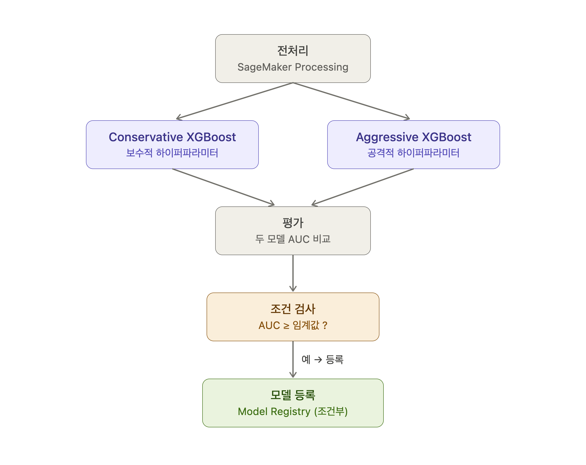

# Amazon SageMaker AI End-to-End ML Workshop

[](LICENSE)
[](https://www.python.org/)
[](https://mlflow.org/)
[](#english)
[](#한국어)

A hands-on workshop for end-to-end machine learning workflows on Amazon SageMaker Unified Studio with MLflow experiment tracking.
/ Amazon SageMaker Unified Studio와 MLflow로 진행하는 엔드투엔드 머신러닝 워크플로우 실습 워크샵.

---

# English

## Overview

This workshop provides a step-by-step guide to building a complete machine learning workflow on **Amazon SageMaker Unified Studio**. It covers data preprocessing, model training, experiment tracking with **MLflow**, evaluation, real-time deployment, and pipeline automation across a sequence of seven Jupyter notebooks.

The workshop contains three independent tracks:
- **Notebooks 0–4** — Bank Marketing dataset, binary classification (predict term-deposit subscription). Run sequentially; notebooks share state via `%store`.
- **Notebook 5** (`5-sagemaker-pipelines.ipynb`) — Bank Marketing dataset, SageMaker Pipelines automation. Orchestrates the preprocessing → training → evaluation → conditional model registration workflow from Notebooks 1–4 into a single reusable pipeline. Requires Notebooks 0 and 1 to be run first.
- **Notebook 6** (`6-pipelines_preprocess_train_evaluate_batch_transform.ipynb`) — UCI Abalone dataset, regression. A standalone SageMaker Pipelines demo that can run independently of Notebooks 0–5.

### How the Notebook 5 pipeline works



```
BankPreprocess
    ├─ BankTrainConservative  (parallel)
    └─ BankTrainAggressive    (parallel)
              └─ BankEvaluate
                      └─ BankAUCCondition
                              ├─ (AUC ≥ threshold) BankRegisterModel
                              └─ (AUC <  threshold) BankPipelineFail
```

**The DAG is built from data flow — you don't declare step order.** SageMaker infers the execution order by looking at which step consumes another step's *output* as its *input*:

- The two training steps take `BankPreprocess`'s output (train/validation channels) as input, so SageMaker automatically orders **preprocess → train**.
- Both training steps reference *only* the same preprocessing output and never reference each other, so they have no dependency between them and **run in parallel**.
- `BankEvaluate` consumes both trained models, so it runs only **after both training jobs finish**.

In other words, you don't write "run B after A" — you *wire* B to consume A's artifacts, and SageMaker derives the order. This data-flow-driven DAG construction is the core idea of SageMaker Pipelines.

**Conditional registration (RegisterModel) is a quality gate.** The `BankAUCCondition` step compares the evaluated AUC against a threshold and runs the next step only when the condition is true:

- **AUC ≥ threshold** → `BankRegisterModel` registers the *better* of the two models to MLflow / the SageMaker Model Registry.
- **AUC < threshold** (neither model clears the bar) → registration is *skipped* and the pipeline ends with **no model** via `BankPipelineFail`.

This branch is exactly what prevents an underperforming model from automatically becoming a production candidate — only models that pass the bar reach the registry, with no manual metric check required.

## Features

- **Scalable data preprocessing** — Run large-scale feature engineering and data splits using SageMaker Processing Jobs.
- **XGBoost training with Script Mode** — Train built-in and custom XGBoost models with hyperparameter tuning via SageMaker Training Jobs.
- **MLflow experiment tracking** — Log parameters, metrics, and artifacts; register models in the MLflow Model Registry.
- **Real-time endpoint deployment with A/B testing** — Deploy models to SageMaker endpoints and route traffic across model variants.
- **Bank Marketing pipeline automation** — Orchestrate preprocessing → dual-model parallel training → evaluation → conditional model registration with SageMaker Pipelines (Notebook 5). The pipeline compares a Conservative and an Aggressive XGBoost model and registers the best to Model Registry only if AUC ≥ threshold.
- **End-to-end pipeline automation** — Orchestrate preprocessing, training, evaluation, and batch transform steps with SageMaker Pipelines (Notebook 6, Abalone dataset).

## Prerequisites

- **Amazon SageMaker Workshop** environment pre-configured — follow the setup guide at [catalog.us-east-1.prod.workshops.aws](https://catalog.us-east-1.prod.workshops.aws/workshops/06dbe60c-3a94-463e-8ac2-18c7f85788d4/ko-KR/07aiml/01-ml) before running this workshop.
- Access to **Amazon SageMaker Unified Studio** (SageMaker Studio domain with a DataZone project)
- Python 3.8 or later
- Jupyter environment (provided by SageMaker Studio)
- AWS IAM role with permissions for SageMaker, S3, and DataZone
- MLflow tracking server provisioned under the `MLExperiments` environment name

## Installation

```bash
# 1. Clone the repository
git clone https://github.com/comeddy/smai-end-to-end-smus.git
cd smai-end-to-end-smus

# 2. Open the cloned directory in SageMaker Studio
# File > Open from path (or use the Studio file browser)

# 3. Run notebook 0 first — it installs dependencies and persists shared config
# The install guard prevents an infinite restart loop on "Run All"
```

> The kernel image ships with modular SageMaker packages only. `0-setup.ipynb` installs
> `sagemaker>=2.220,<3`, `mlflow==2.13.2`, and `setuptools<81` automatically.

## Usage

Run the notebooks in order:

```text
0-setup.ipynb                    # Initialize environment, connect MLflow tracking server
1-preprocessing.ipynb            # Preprocess data with SageMaker Processing Job
2-training.ipynb                 # Train XGBoost models, register to MLflow Model Registry
3-model-evaluation.ipynb         # Evaluate and compare models, select the best
4-test-and-deploy.ipynb          # Deploy to SageMaker endpoint, run A/B test
5-sagemaker-pipelines.ipynb      # Bank Marketing pipeline: preprocess → train (x2) → evaluate → register
6-pipelines_...ipynb             # (Standalone) SageMaker Pipelines demo with Abalone dataset
```

> **Notebook 5 prerequisites**: Run `0-setup.ipynb` and `1-preprocessing.ipynb` first so that
> `input_source` and other shared variables are available via `%store`.

Example: invoking the deployed endpoint from Notebook 4.

```python
# Send a single preprocessed CSV row to a deployed SageMaker endpoint and print the prediction score.
import boto3, json

runtime = boto3.client("sagemaker-runtime", region_name=region)
response = runtime.invoke_endpoint(
    EndpointName=endpoint_name,
    ContentType="text/csv",
    Body="44,1,0,1,0,0,0,1,0,0,0,0,1,0,0,0,1,0,0,0,0,1,0,0,0,0,0,1,0,0,1,0"
)
print(json.loads(response["Body"].read()))
# Output: {'predictions': [{'score': 0.12}]}
```

## Project Structure

```text
smai-end-to-end-smus/
├── 0-setup.ipynb                          # Environment setup and MLflow connection
├── 1-preprocessing.ipynb                  # SageMaker Processing Job — feature engineering
├── 2-training.ipynb                       # SageMaker Training Job — XGBoost + MLflow
├── 3-model-evaluation.ipynb               # Model comparison and best-model selection
├── 4-test-and-deploy.ipynb                # Real-time endpoint deploy + A/B test
├── 5-sagemaker-pipelines.ipynb            # Bank Marketing pipeline automation (Lab 5)
├── 6-pipelines_preprocess_train_          # Standalone SageMaker Pipelines demo (Abalone, Lab 6)
│   evaluate_batch_transform.ipynb
├── pipeline_code/                         # Scripts used by Notebook 5 pipeline
│   ├── preprocessing.py                   #   — Feature engineering (sep=",", y_no leakage-free)
│   ├── evaluation.py                      #   — Dual-model AUC comparison
│   └── requirements.txt                   #   — pandas, numpy, scikit-learn
├── CLAUDE.md                              # Claude Code project instructions
└── README.md                             # This file

# Runtime-generated (gitignored):
# code/          — Python scripts emitted by %%writefile cells
# processing/    — Preprocessing script for SageMaker Processing
# training/      — Training script for SageMaker Training
# bank-additional/ — Bank Marketing dataset (downloaded by Notebook 0)
# data/          — Processed train/validation/test splits
# mlruns/        — Local MLflow run artifacts
```

## Contributing

1. Fork the repository.
2. Create a feature branch.
   ```bash
   git checkout -b feat/your-feature-name
   ```
3. Commit your changes using [Conventional Commits](https://www.conventionalcommits.org/).
   ```bash
   git commit -m "feat: add hyperparameter tuning example to notebook 2"
   # Other prefixes: fix:, docs:, refactor:, chore:
   ```
4. Push the branch.
   ```bash
   git push origin feat/your-feature-name
   ```
5. Open a Pull Request against `main`.

## License

This project is licensed under the [MIT License](LICENSE).

## Contact

- **Maintainer**: [AWS SA Chloe(YoungHwa) Kwak](https://github.com/chloe-kwak) | [linked](https://www.linkedin.com/in/younghwakwak/)
- **Maintainer**: [AWS SA Youngjin Kim](https://github.com/comeddy) | [linked](https://www.linkedin.com/in/zerojin/)
- **Issues**: [github.com/comeddy/smai-end-to-end-smus/issues](https://github.com/comeddy/smai-end-to-end-smus/issues)
- **Email**: comeddy@gmail.com, youngjik@amazon.com

---

# 한국어

## 개요

이 워크샵은 **Amazon SageMaker Unified Studio** 위에서 완전한 머신러닝 워크플로우를 단계별로 구축하는 실습 가이드입니다. 데이터 전처리, 모델 훈련, **MLflow** 실험 추적, 평가, 실시간 배포, 파이프라인 자동화까지 7개의 Jupyter 노트북으로 구성되어 있습니다.

워크샵은 세 개의 독립적인 트랙으로 구성됩니다.
- **노트북 0–4** — 은행 마케팅 데이터셋, 이진 분류 (정기예금 가입 여부 예측). 순차 실행하며 `%store`를 통해 노트북 간 상태를 공유합니다.
- **노트북 5** (`5-sagemaker-pipelines.ipynb`) — 은행 마케팅 데이터셋, SageMaker Pipelines 자동화. 노트북 1–4의 전처리 → 훈련(병렬) → 평가 → 조건부 모델 등록 워크플로우를 하나의 재사용 가능한 파이프라인으로 오케스트레이션합니다. 노트북 0과 1을 먼저 실행해야 합니다.
- **노트북 6** (`6-pipelines_preprocess_train_evaluate_batch_transform.ipynb`) — UCI Abalone 데이터셋, 회귀. 노트북 0–5와 무관하게 단독 실행 가능한 SageMaker Pipelines 독립 데모입니다.

### 노트북 5 파이프라인 동작 원리


```
BankPreprocess
    ├─ BankTrainConservative  (병렬)
    └─ BankTrainAggressive    (병렬)
              └─ BankEvaluate
                      └─ BankAUCCondition
                              ├─ (AUC ≥ 임계값) BankRegisterModel
                              └─ (AUC <  임계값) BankPipelineFail
```

**DAG는 "데이터 흐름"으로 자동 구성되며, 단계 순서를 직접 선언하지 않습니다.** SageMaker는 한 단계가 다른 단계의 *출력*을 *입력*으로 참조하는지를 보고 실행 순서를 추론합니다.

- 두 학습 단계가 `BankPreprocess`의 출력(train·validation 채널)을 입력으로 받으므로, SageMaker가 자동으로 **전처리 → 학습** 순서를 잡습니다.
- 두 학습 단계는 *동일한 전처리 출력만* 참조하고 서로를 참조하지 않으므로, 둘 사이에 의존성이 없어 **병렬로 실행**됩니다.
- `BankEvaluate`는 두 학습 모델을 모두 입력으로 받으므로, 두 학습이 **모두 끝난 뒤**에만 실행됩니다.

즉, "A 다음에 B를 실행하라"고 순서를 적는 대신 **B가 A의 결과물을 사용하도록 배선(wiring)하면 순서는 SageMaker가 알아서 결정**합니다. 이렇게 데이터 흐름만으로 DAG가 자동 구성되는 것이 SageMaker Pipelines의 핵심입니다.

**조건부 모델 등록(RegisterModel)은 품질 게이트입니다.** `BankAUCCondition` 단계는 평가된 AUC를 임계값과 비교하여, **조건이 참일 때만** 다음 단계를 실행합니다.

- **AUC ≥ 임계값** → `BankRegisterModel`이 두 모델 중 *더 나은 쪽*을 MLflow / SageMaker Model Registry에 등록합니다.
- **AUC < 임계값** (어느 모델도 기준 미달) → 등록을 *건너뛰고* `BankPipelineFail`로 파이프라인이 **모델 없이 종료**됩니다.

이 분기가 바로 **"성능 미달 모델이 자동으로 프로덕션 후보가 되는 것"을 막는 품질 게이트(quality gate)** 역할입니다. 사람이 매번 메트릭을 확인하지 않아도, 기준을 통과한 모델만 레지스트리에 올라갑니다.

## 주요 기능

- **확장 가능한 데이터 전처리** — SageMaker Processing Job으로 대용량 특성 엔지니어링 및 데이터 분할을 수행합니다.
- **Script Mode XGBoost 훈련** — SageMaker Training Job을 통해 빌트인 및 커스텀 XGBoost 모델을 훈련하고 하이퍼파라미터를 튜닝합니다.
- **MLflow 실험 추적** — 파라미터, 메트릭, 아티팩트를 기록하고 MLflow Model Registry에 모델을 등록합니다.
- **A/B 테스트를 포함한 실시간 엔드포인트 배포** — SageMaker 엔드포인트에 모델을 배포하고 트래픽을 여러 모델 변형에 분산합니다.
- **은행 마케팅 파이프라인 자동화** — SageMaker Pipelines로 전처리 → Conservative/Aggressive XGBoost 병렬 훈련 → 평가 → AUC 임계값 기반 조건부 모델 등록을 오케스트레이션합니다 (노트북 5).
- **엔드투엔드 파이프라인 자동화** — SageMaker Pipelines로 전처리, 훈련, 평가, 배치 변환 단계를 오케스트레이션합니다 (노트북 6, Abalone 데이터셋).

## 사전 요구 사항

- **Amazon SageMaker Workshop** 환경이 사전 구성되어 있어야 합니다 — 이 워크샵을 시작하기 전에 [워크샵 설정 가이드](https://catalog.us-east-1.prod.workshops.aws/workshops/06dbe60c-3a94-463e-8ac2-18c7f85788d4/ko-KR/07aiml/01-ml)를 먼저 완료하십시오.
- **Amazon SageMaker Unified Studio** 접근 권한 (DataZone 프로젝트가 포함된 SageMaker Studio 도메인)
- Python 3.8 이상
- Jupyter 환경 (SageMaker Studio에서 제공)
- SageMaker, S3, DataZone 권한이 포함된 AWS IAM 역할
- `MLExperiments` 환경 이름으로 프로비저닝된 MLflow 추적 서버

## 설치 방법

```bash
# 1. 저장소를 클론합니다
git clone https://github.com/comeddy/smai-end-to-end-smus.git
cd smai-end-to-end-smus

# 2. SageMaker Studio에서 클론된 디렉토리를 엽니다
# File > Open from path (또는 Studio 파일 브라우저 사용)

# 3. 0번 노트북을 먼저 실행합니다 — 의존성을 설치하고 공유 설정을 저장합니다
# 설치 가드가 "Run All" 시 무한 재시작 루프를 방지합니다
```

> 커널 이미지에는 모듈형 SageMaker 패키지만 포함되어 있습니다. `0-setup.ipynb`가
> `sagemaker>=2.220,<3`, `mlflow==2.13.2`, `setuptools<81`을 자동으로 설치합니다.

## 사용법

노트북을 순서대로 실행합니다.

```text
0-setup.ipynb                    # 환경 초기화, MLflow 추적 서버 연결
1-preprocessing.ipynb            # SageMaker Processing Job으로 데이터 전처리
2-training.ipynb                 # XGBoost 모델 훈련, MLflow Model Registry에 등록
3-model-evaluation.ipynb         # 모델 비교 및 최고 성능 모델 선택
4-test-and-deploy.ipynb          # SageMaker 엔드포인트 배포, A/B 테스트
5-sagemaker-pipelines.ipynb      # 은행 마케팅 파이프라인: 전처리 → 훈련(병렬) → 평가 → 등록
6-pipelines_...ipynb             # (독립 실행) Abalone 데이터셋으로 SageMaker Pipelines 데모
```

> **노트북 5 사전 요건**: `%store`를 통해 `input_source` 등 공유 변수를 로드하므로
> `0-setup.ipynb`와 `1-preprocessing.ipynb`를 먼저 실행해야 합니다.

노트북 4에서 배포된 엔드포인트를 호출하는 예시입니다.

```python
# 이미 배포된 SageMaker 엔드포인트에 전처리된 CSV 한 행을 실시간으로 보내 예측 점수를 받아 출력합니다.
import boto3, json

runtime = boto3.client("sagemaker-runtime", region_name=region)
response = runtime.invoke_endpoint(
    EndpointName=endpoint_name,
    ContentType="text/csv",
    Body="44,1,0,1,0,0,0,1,0,0,0,0,1,0,0,0,1,0,0,0,0,1,0,0,0,0,0,1,0,0,1,0"
)
print(json.loads(response["Body"].read()))
# 출력 예시: {'predictions': [{'score': 0.12}]}
```

## 프로젝트 구조

```text
smai-end-to-end-smus/
├── 0-setup.ipynb                          # 환경 설정 및 MLflow 연결
├── 1-preprocessing.ipynb                  # SageMaker Processing Job — 특성 엔지니어링
├── 2-training.ipynb                       # SageMaker Training Job — XGBoost + MLflow
├── 3-model-evaluation.ipynb               # 모델 비교 및 최적 모델 선택
├── 4-test-and-deploy.ipynb                # 실시간 엔드포인트 배포 + A/B 테스트
├── 5-sagemaker-pipelines.ipynb            # 은행 마케팅 파이프라인 자동화 (Lab 5)
├── 6-pipelines_preprocess_train_          # 독립 SageMaker Pipelines 데모 (Abalone, Lab 6)
│   evaluate_batch_transform.ipynb
├── pipeline_code/                         # 노트북 5 파이프라인에서 사용하는 스크립트
│   ├── preprocessing.py                   #   — 특성 엔지니어링 (쉼표 구분자, y_no 누수 제거)
│   ├── evaluation.py                      #   — 두 모델 AUC 비교
│   └── requirements.txt                   #   — pandas, numpy, scikit-learn
├── CLAUDE.md                              # Claude Code 프로젝트 지침
└── README.md                             # 이 파일

# 런타임 생성 파일 (gitignore 적용):
# code/          — %%writefile 셀이 생성하는 Python 스크립트
# processing/    — SageMaker Processing 전처리 스크립트
# training/      — SageMaker Training 훈련 스크립트
# bank-additional/ — 은행 마케팅 데이터셋 (노트북 0에서 다운로드)
# data/          — 전처리된 훈련/검증/테스트 분할 데이터
# mlruns/        — 로컬 MLflow 실행 아티팩트
```

## 기여 방법

1. 저장소를 포크합니다.
2. 기능 브랜치를 생성합니다.
   ```bash
   git checkout -b feat/기능-이름
   ```
3. [Conventional Commits](https://www.conventionalcommits.org/) 형식으로 커밋합니다.
   ```bash
   git commit -m "feat: 노트북 2에 하이퍼파라미터 튜닝 예시 추가"
   # 그 외 접두사: fix:, docs:, refactor:, chore:
   ```
4. 브랜치를 푸시합니다.
   ```bash
   git push origin feat/기능-이름
   ```
5. `main` 브랜치를 대상으로 Pull Request를 엽니다.

## 라이선스

이 프로젝트는 [MIT 라이선스](LICENSE)를 따릅니다.

## 연락처

- **메인테이너**: [AWS SA Chloe(YoungHwa) Kwak](https://github.com/chloe-kwak) | [linked](https://www.linkedin.com/in/younghwakwak/)
- **메인테이너**: [AWS SA Youngjin Kim](https://github.com/comeddy) | [linked](https://www.linkedin.com/in/zerojin/)
- **이슈 트래커**: [github.com/comeddy/smai-end-to-end-smus/issues](https://github.com/comeddy/smai-end-to-end-smus/issues)
- **이메일**: comeddy@gmail.com, youngjik@amazon.com
